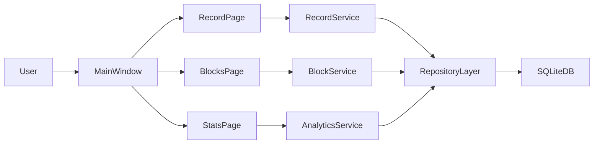

# Insight（Windows）详细开发计划

## 1. 已确认范围
- 项目名：`Insight`。
- 平台：仅 Windows。
- 技术栈：`Python + PySide6 + SQLite + SQLAlchemy + pandas + matplotlib`。
- 导航结构：左侧栏，包含 `记录` / `统计` / `方块管理` / `设置`。
- MVP 目标：先做 `记录 + 基础统计`，不做因果实验。
- 记录模型：`事件方块（模板） + 记录实例`。
- 重合规则：采用独立记录模型，允许时间重叠；每条重合事件都可评分。

## 2. 数据模型与统计口径（先定标准再开发）

### 2.1 表结构
- `event_blocks`
  - `id`
  - `name`（唯一）
  - `color`
  - `is_active`
  - `created_at` / `updated_at`
- `activity_records`
  - `id`
  - `block_id`（外键 -> `event_blocks.id`）
  - `start_time`
  - `end_time`
  - `efficiency_score`（1-5）
  - `state_score`（1-5，可选，默认空）
  - `tags`（可选，覆盖字段）
  - `note`（可选，覆盖字段）
  - `created_at` / `updated_at`

### 2.2 关键口径
- 允许重叠：同一时间段内多条记录并存，不做互斥校验。
- 统计“频率”按记录条数；“时长”按每条独立累计（MVP 不做重叠去重时长）。
- 方块维度统计以 `block_id` 聚合，保证“相同事件可比较”。
- 评分口径固定 1-5，记录后允许编辑但保留 `updated_at` 用于审计。

## 3. GUI 页面详细设计（MVP）

### 3.1 `记录` 页
- 顶部：快速新建区
  - 方块下拉选择（支持搜索）
  - 模式切换：`计时模式`（开始/停止）与 `手动模式`（起止时间）
  - 分数输入：效率必填、状态可选
  - 标签/备注输入
  - 保存按钮
- 中部：今日时间轴列表（按开始时间排序，可见重叠）
- 底部：最近记录表（编辑/删除）
- 交互规则：
  - 计时中禁止重复开启同一条临时计时任务
  - 手动模式校验 `end_time > start_time`

### 3.2 `方块管理` 页
- 方块列表：名称、颜色、启用状态、使用次数
- 操作：新增、编辑、停用/启用
- 新增流程：输入名称+颜色即可创建，便于低成本扩展

### 3.3 `统计` 页
- 时间范围切换：`最近7天` / `最近30天`
- 基础三图：
  - 每日记录频率折线图
  - 每日平均效率折线图
  - 每日平均状态折线图
- 方块维度摘要：各方块记录数与总时长（表格）

### 3.4 `设置` 页
- 数据库路径显示（只读）
- 评分说明查看
- 提醒开关（为后续“缺失记录提醒”预留）

## 4. 分阶段实施（学习优先）

### 阶段 A：方块管理 + 记录 CRUD
- 先完成数据库初始化、方块管理页面、记录页面核心流程。
- 验收：可创建方块并用方块快速记录活动，支持编辑删除与重启持久化。

### 阶段 B：统计看板
- 接入 pandas 聚合和 matplotlib 嵌入图表。
- 验收：7/30 天切换可用，三个基础图正常显示。

### 阶段 C：低摩擦体验
- 补充最近方块一键复用、计时模式稳定性、输入校验与错误提示。
- 验收：1 分钟可完成 3 条记录。

### 阶段 D：工程化与发布
- 增加基础测试、日志、打包脚本与发布说明。
- 验收：Windows 可执行包可运行，核心流程有自动化测试覆盖。

## 5. 学习协作机制（固定执行）
- 每次迭代按 5 步走：目标讲解 -> 最小实现 -> 你做 30% 练习 -> 代码评审 -> 复盘笔记。
- 每阶段结束形成一份“你能复述”的流程卡片：
  - 需求如何拆分
  - 数据如何落库
  - UI 如何绑定数据
  - 如何自测与回归

## 6. 关键文件（实现时对应）
- `idea.txt`
- `docs/mvp-spec.md`
- `docs/dev-notes.md`
- `src/app/main.py`
- `src/app/ui/main_window.py`
- `src/app/ui/record_page.py`
- `src/app/ui/blocks_page.py`
- `src/app/ui/stats_page.py`
- `src/app/domain/models.py`
- `src/app/storage/database.py`
- `src/app/services/analytics_service.py`
- `tests/test_record_flow.py`

## 7. 架构图（MVP）

## 8. 完成定义（DoD）
- GUI 四页全部可交互，无关键阻塞错误。
- 方块创建后可立即用于记录，新增事件可随时添加。
- 重叠事件可正常保存并参与统计。
- 统计页可展示基础三图与方块聚合表。
- 有最小测试和 Windows 打包流程文档。
